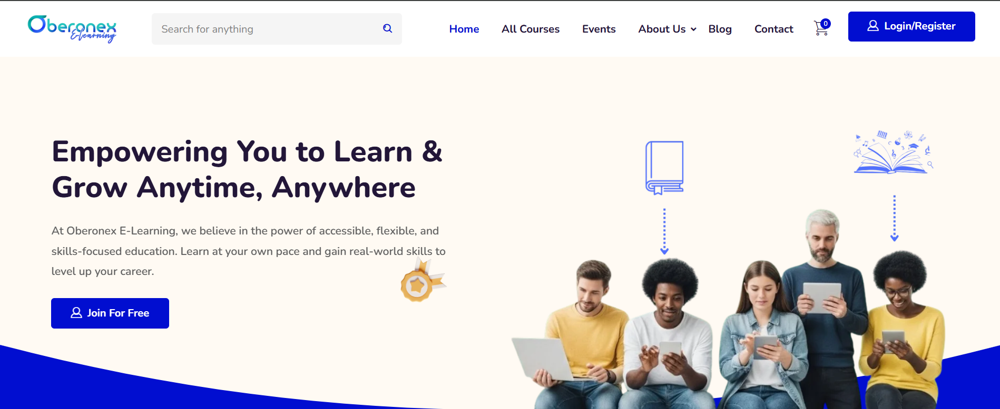

# Oberonex E-Learning – Case Study

This repository contains the case study of the Oberonex e-learning portal, built with WordPress and Elementor with an LMS plugin.

## Project Overview
The goal was to deliver a structured training portal with course pages, lesson flow, and easy content updates. Focus on clear navigation, mobile usability, and quick load times.

## Key Features
- Course, lesson, and quiz page templates
- Mobile-friendly layouts
- Organized categories and breadcrumb navigation
- Contact/lead capture for enrollments
- Performance basics (caching & image optimization)

## Tools & Technologies
- WordPress
- Elementor (page building)
- LMS plugin (e.g., LearnDash or equivalent)
- LiteSpeed Cache (performance)
- SEO plugin (Yoast/RankMath)
- Image optimization plugin

## My Role
- Theme/LMS setup & configuration
- Page layout design using Elementor
- Content structuring & course organization
- Performance & basic SEO setup

## Project Link
[Live Website](https://learn.oberonex.com/)

## 📷 Screenshots

📸 View Screens

**Homepage**  

**Mobile Contact Form**  

