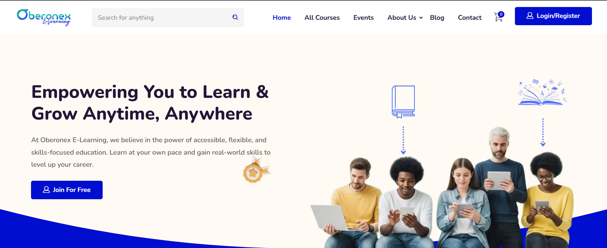

# Oberonex E-Learning | Case Study

A structured training portal developed for Oberonex, built with WordPress and Elementor, integrated with an LMS plugin to deliver course content, quizzes, and progress tracking.

## Project Overview

The goal was an online learning platform with course pages, a clear lesson flow, and content that's easy to update. The design focuses on mobile usability, organized course navigation, and smooth performance.

## Tech Stack

- WordPress
- Elementor & Elementor Pro
- LMS plugin (LearnDash or equivalent)
- LiteSpeed Cache
- SEO plugin (Yoast/RankMath)
- Image optimization plugins

## My Role

- Theme and LMS setup and configuration
- Course, lesson, and quiz page templates
- Page layout design using Elementor
- Content structuring and course organization
- Performance optimization (caching and image compression)
- Basic SEO setup for course content visibility

## Key Results

- Streamlined course flow across lessons and quizzes
- Improved mobile usability for learners
- Faster load times through caching and image optimization
- Clear course categorization with breadcrumb navigation
- More enrollments through optimized contact and lead capture forms

## Challenge

Delivering a smooth learning flow (lessons, quizzes, progress tracking) while keeping content updates easy for non-technical staff.

## Solution

Integrated an LMS plugin with Elementor templates, building reusable layouts for lessons and quizzes while keeping backend management simple.

## Live Project

Visit [Oberonex Learn](https://learn.oberonex.com/)

## Screenshots

View Screens

**Homepage**  

**Mobile Contact Form**  

